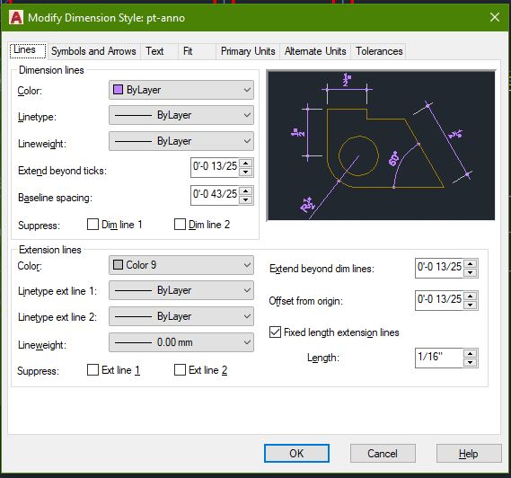
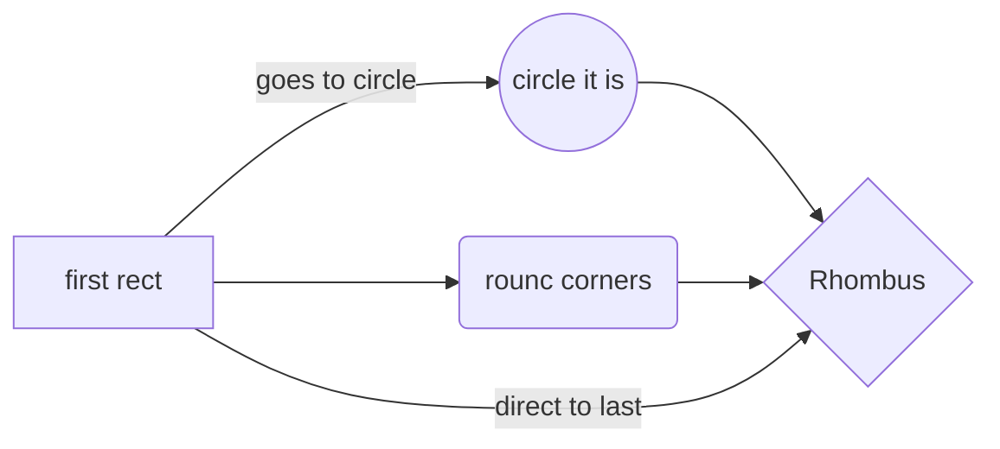

# Learning Markdown

## Second Headline

*italic*
**bold**

> Once

>> fgdsfgfdgg h This is code

`code tag`

---

<span class="special">html code</span>

## Files

+ files in your browser,
  1. which
  2. saved **offline!**
+ dafdasfdfa

## Create

www.google.com

sdfas@gmail.com

[The file explorer](www.google.com) is ~~accessible~~.

this is reference [this is reference][officialSite]

[officialSite]: www.perception.com.np

---



[ "title goes here"](www.google.com)

``` C++
github style code
df
df
f
df
df
f
fsd
```

## Tables

simple Table:

|first header | second header | third header|
|:------|:-----:|----:|
|content|content|content|
|content|content|content|
|content|content|content|

## KaTeX

You can render LaTeX mathematical expressions using [KaTeX](https://khan.github.io/KaTeX/):

The *Gamma function* satisfying $\Gamma(n) = (n-1)!\quad\forall n\in\mathbb N$ is via the Euler integral

$$
\Gamma(z) = \int_0^\infty t^{z-1}e^{-t}dt\,.
$$

> You can find more information about **LaTeX** mathematical expressions [here](http://meta.math.stackexchange.com/questions/5020/mathjax-basic-tutorial-and-quick-reference).

## UML diagrams

You can render UML diagrams using [Mermaid](https://mermaidjs.github.io/). This will produce a flow chart:


